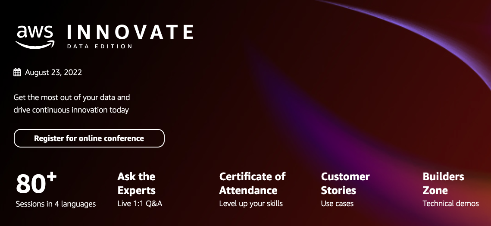

  

The following labs will give you hands-on experience with a number of the topics discussed during the AWS Innovate Data Edition.

ℹ️ **You will run these lab in your own AWS account. Please follow directions at the end of the labs to remove resources to minimize costs.**

These labs will remain available after AWS Innovate Data Edition **You can do them at any time**

# [Orchestrate data processing with Step Functions and the Redshift Data API](https://github.com/joshtow/Orchestrate-Data-Pipeline-with-Step-Functions)

In this lab, we explain how to use AWS Step Functions to orchestrate actions in your Amazon Redshift data warehouse using Amazon Redshift Data API. We create and use a Step Function model to load data to a data lake, catalog and prepare the data, load the data into Amazon Redshift and create data queries spanning the data warehouse and data lake with Amazon Redshift Spectrum.

Duration: Approximately 45 minutes

[View lab instructions](https://github.com/joshtow/Orchestrate-Data-Pipeline-with-Step-Functions)

# [Using Amazon Macie to discover sensitive data and automatically update access controls](https://github.com/joshtow/Amazon-Macie-and-Lake-Formation-TBAC)

In this lab, learn how to configure Amazon Macie to automatically detect sensitive data in an S3 bucket and apply appropriate tags in AWS Lake Formation. Amazon Macie uses machine learning to discover sensitive data in S3 buckets while AWS Lake Formation provides tag-based access control to provide a scalable and flexible way to manage data access in the data lake.

Duration: Approximately 45 minutes

[View lab instructions](https://github.com/joshtow/Amazon-Macie-and-Lake-Formation-TBAC)

# [Real-time analytics with Amazon Redshift streaming ingestion](https://github.com/phonghuule/Real-time-analytics-with-Amazon-Redshift-streaming)

In this lab, we demonstrate the steps to create an Amazon Kinesis data stream which generate and load streaming data, create a materialized view, and query the stream to visualize the results.

Duration: Approximately 60 minutes

[View lab instructions](https://github.com/phonghuule/Real-time-analytics-with-Amazon-Redshift-streaming)

# [Text Extraction and Analysis Using Amazon Textract and Amazon Comprehend](https://github.com/phonghuule/textract-comprehend)

In this lab, we extract the features of a text document using Amazon Textract, then use Amazon Comprehend to analyze the extracted features. Learn how to connect these AWS services together using AWS Lambda.

Duration: Approximately 30 minutes

[View lab instructions](https://github.com/phonghuule/textract-comprehend)

# [Analyze data with AWS Lake Formation and Amazon QuickSight](https://github.com/phonghuule/Securely-analyze-your-data-with-AWS-Lake-Formation-and-Amazon-QuickSight)

In this lab, we demonstrate the steps in which you can securely store, analyze, and visualize sensitive customer data. Get started by storing encrypted sample test data in Amazon Simple Storage Service (Amazon S3) based data lake. Learn how to use AWS Lake Formation to configure fine-grained permissions to restrict user access as well as analyze the data and visualize business insights using Amazon QuickSight.

Duration: Approximately 60 minutes

[View lab instructions](https://github.com/phonghuule/Securely-analyze-your-data-with-AWS-Lake-Formation-and-Amazon-QuickSight)

# [Data preparation using Amazon Redshift with AWS Glue DataBrew](https://github.com/phonghuule/Data-preparation-using-Amazon-Redshift-with-AWS-Glue-DataBrew)

In this lab, we explain how to use AWS Glue DataBrew to clean data from an Amazon Redshift table including transforming and using different feature engineering techniques to prepare data and build a machine learning (ML) model.

Duration: Approximately 60 minutes

[View lab instructions](https://github.com/phonghuule/Data-preparation-using-Amazon-Redshift-with-AWS-Glue-DataBrew)

# [Monitoring operations with Amazon OpenSearch](https://github.com/phonghuule/Monitoring-Operations-With-Amazon-ElasticSearch)

In this lab, you will understand how to use Amazon OpenSearch by actually building a real-time dashboard and performing a full-text search using Amazon OpenSearch and related AWS services. The goals of this lab is to provide you a basic knowledge of Amazon OpenSearch for future use.

Duration: Approximately 60 minutes

[View lab instructions](https://github.com/phonghuule/Monitoring-Operations-With-Amazon-ElasticSearch)

# [Real-Time clickstream anomaly detection with Amazon Kinesis Data Analytics](https://github.com/phonghuule/Real-Time-Clickstream-Anomaly-Detection-Kinesis-Analytics)

Amazon Kinesis Data Analytics is a managed service that makes it easy to identify and respond to changes in data behavior in real-time. In this lab, learn how to use Amazon Kinesis Data Analytics to detect clickstream anomalies in real-time.

Duration: Approximately 45 minutes

[View lab instructions](https://github.com/phonghuule/Real-Time-Clickstream-Anomaly-Detection-Kinesis-Analytics)